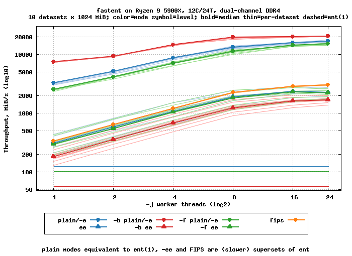

# fastent

fastent: high-throughput entropy and randomness tester for byte and bit
streams, with deterministic multi-threaded output and runtime SIMD
dispatch.
Licensed under the terms of GNU GPL version 3 only - see [`COPYING`](COPYING).
Report issues to Kamila Szewczyk &lt;k@iczelia.net&gt;.
Project homepage: https://github.com/iczelia/fastent

[](https://github.com/iczelia/fastent/actions/workflows/ci.yml)


## What it reports

Default output: Shannon entropy, chi-square statistic with tail
probability, arithmetic mean, Monte Carlo value of pi, and serial
correlation coefficient.  `-e` is repeatable; tiers are bucketed by
measured per-test single-thread throughput.

`-e` adds the basic extended stats (min-entropy, collision entropy and
index of coincidence, a poker test, variance and standard deviation,
redundancy, the distinct-symbol count, the most/least common symbol,
per-bit-position bias), the LZ77F match-finder estimator, and the
Bandt-Pompe permutation entropy: the two grid-based tests in the
"fast" band, both running at 1-2 GiB/s single-thread on a Zen 4.

`-ee` adds the order-1 bigram conditional entropy `H(cur|prev)` and
adjacent mutual information `I(prev;cur)`, a longest identical-symbol
run, a runs test, and a bit-mode cusum max excursion.  Exposes order-1
structure (text, code, many binary formats) that the order-0 measures
and the linear serial correlation miss.

`-eee` adds the slow grid-based tests: a windowed linear-complexity
estimator (per 512-bit window GF(2) Berlekamp-Massey, `bm_deviation`
catches LFSR-class recurrences), a Maurer universal statistical test
(fixed `L = 8`, `maurer_deviation` catches repetitive / compressible
sources the other screens miss), and a NIST binary matrix-rank test
(32x32 GF(2) matrices, `mrank_dev` catches truncated-bit linear
structure).  Single-thread throughput in this band runs 50-350 MiB/s,
gated by Berlekamp-Massey.

Byte mode by default; bit mode under `-b`.  Output formats:
human-readable, CSV (`-t`), JSON (`-J`), and an interpretive pass/fail
report (`-a`/`--annotate`); add a per-value occurrence table with `-c`
or a terminal block-plot of the histogram with `-H`.

## Highlights

- 4-way banked SIMD histogram inner loop; serial-correlation
  cross-product via `VPMADDUBSW`/`PSADBW` (SVE2: `svdot_u32` at the
  native vector length); bit-mode popcount via `VPOPCNTB`, with
  PSHUFB / `vcntq_u8` / `wasm_i8x16_popcnt` fallbacks
- runtime CPU dispatch: scalar / SSSE3 / SSE4.1 / AVX2 / AVX-512
  (F + BW + BITALG) / NEON / SVE2 / ARMv7-A NEON / WebAssembly SIMD128
- `-i`/`--io={auto,mmap,stream,uring}` input strategy: `mmap` with
  sequential advice, `uring` async pipeline (io_uring / IOCP),
  `stream` portable `read(2)` loop
- extended statistics (`-e`): min-entropy, collision entropy / IC,
  poker test, variance, redundancy, distinct/mode/rarest, per-bit
  bias; derived at finalisation, no per-byte cost, bit-identical
  across hosts and thread counts.  `--annotate` turns them into a
  per-metric PASS / WEAK / FAIL report with a headline verdict
- `--fips-140-2`: the FIPS 140-2 4.9.1 RNG power-up tests (monobit,
  poker, runs, long run) per 20000-bit block; pass/fail report,
  exit 1 on failure, parallel and bit-identical across thread counts
- order-1 bigram (`-ee`): conditional entropy `H(cur|prev)`, adjacent
  mutual information `I(prev;cur)`, runs / longest-run / cusum; split
  across the `-j` workers and merged with a boundary stitch,
  deterministic and bit-identical across thread counts (~1 MiB/thread
  byte table, 2x2 in bit mode)
- LZ77F estimator (`-e`): a count-only (acceleration 1,
  HLOG 13) match finder; compressibility excess, literal byte
  entropy / KL, match coverage, offset and match-length
  concentration, an advisory literal chi-square, and a headline
  `lz_deviation` z badged PASS / WEAK / FAIL.  Keyed to a fixed
  4 MiB absolute-offset block grid.  Sortable via
  `--sort-by=lz-deviation` / `lz-cr` / `lz-match-cov`; `-e -H`
  adds log2-bucket offset / length plots and a literal byte plot
- linear-complexity estimator (`-eee`, slowest grid test ~55 MiB/s
  single-thread): per 512-bit window GF(2) Berlekamp-Massey yields
  the shortest-LFSR length L; mean L vs the random-sequence
  expectation `bm_mu` gives
  a headline `bm_deviation` z badged PASS / WEAK / FAIL, plus an
  advisory NIST class chi-square. `-eee -H` adds an L
  histogram.  Catches LFSR-class and low-bit linear recurrences,
  not a truncated-high-byte LCG.
- Maurer universal test (`-eee`): a count-only Maurer scorer on the MSB-first bit
  stream with fixed `L = 8`; the mean log2 recurrence distance
  `maurer_fn` versus the NIST SP800-22 `maurer_expected` gives a
  headline `maurer_deviation` z badged PASS / WEAK / FAIL.  Fresh
  recency table per 4 MiB grid block, partials combined in absolute
  block order (bit-identical for any `-j` / I/O / host; drift versus
  whole-stream Maurer at most about 0.001%).  Sortable via
  `--sort-by=maurer-deviation`; `-eee -H` adds a log2-distance
  plot.  Catches repetitive / compressible sources the other
  screens miss; a global compressibility statistic, not a locator.
- binary matrix-rank estimator (`-eee`, NIST SP800-22 sec 2.5):
  partitions the bit stream into 32x32 GF(2) matrices, scores each
  matrix rank by Gauss-Jordan, bins into r=32 / r=31 / r<=30 and
  chi-squares against the NIST closed-form probabilities (df = 2);
  the headline `mrank_dev` is `sqrt(chi2)` badged PASS / WEAK / FAIL.
  128 divides the 4 MiB grid so matrices never straddle (exact
  integer sum-merge, bit-identical for any `-j` / I/O / host).
  Sortable via `--sort-by=mrank-dev`.  Catches truncated-bit linear
  recurrences that the byte-mode order-0 and the 512-bit Berlekamp-
  Massey scorer can both miss.
- Bandt-Pompe permutation entropy (`-e`, m = 4): folds each length-4
  byte window to one of 24 ordinal Lehmer-code patterns and computes
  the normalised entropy `perment_h_norm` in `[0, 1]`; the headline
  `perment_deviation` z scales `(1 - H_norm)` by the IID-variance,
  badged PASS / WEAK / FAIL.  Sum-merged on the 4 MiB grid with
  bounded boundary drift (mirrors LZ77F).  Sortable via
  `--sort-by=perment-dev`; with `-H` a 24-bin pattern plot follows.
  Catches short-range monotone / ordinal structure missed by order-0
  and order-1; blind to long-range patterns by construction.
- recursive mode (`-r DIR`): one CSV / JSON row per file, sortable via
  `--sort-by` (path, entropy, chisq, the extended columns, ...)
- terminal histogram (`-H`) with Unicode block glyphs, a Y-axis
  max-value scale and an aligned X-axis tick row, optional log Y
  axis (`--log`), platform-native colouring
- optional worker pool (pthread / Win32): mmap slabs or an SPMC
  stream/io_uring pipeline, both 6-aligned; output byte-identical
  to `-j 1`
- faithfully-rounded, libm-free entropy (double-double Horner over a
  128-entry log table); bit-identical across libc / FPU
- portable C99 sources: builds under gcc, clang, mingw-w64, DJGPP,
  and TinyCC; only the SIMD bodies need a vendor-extended compiler

## Requirements

- Any C99 compiler with a working libc (gcc, clang, tcc all known to work)
- autotools (`autoconf`, `automake`), `make`
- `pthreads` (optional; build without via `--disable-threads`)

## Build from a release tarball

```sh
./configure --enable-native --enable-lto
make -j"$(nproc)"
make check
```

## Build from git

```sh
./bootstrap
./configure --enable-native --enable-lto
make -j"$(nproc)"
make check
```

## Install

```sh
sudo make install
```

## Configure options

- `--enable-native` - `-march=native -mtune=native`
- `--enable-lto` - link-time optimisation
- `--disable-threads` - single-threaded build, no pthread dependency
- `--disable-wasm128` - skip the WebAssembly SIMD128 analyse body
  (target older wasm runtimes without the SIMD128 proposal; scalar
  variant dispatches in its place)
- `--with-windows-target=vista|win95` - Windows target version
  - `vista` (default): wide-API path, modern PE subsystem
  - `win95`: narrow-API path, PE subsystem 4.0, kernel32 + msvcrt imports only

## Supported platforms

Verified to compile and pass `make check`:

Primary platforms:
- Linux: x86_64, i386, aarch64 (NEON + SVE2), armhf (NEON) (gcc, clang, tcc)
- Windows: x86_64, i686, aarch64 (mingw-w64, zig cc) - threads + IOCP on Vista+
- macOS: x86_64, aarch64 (NEON + SVE2) (clang)
- OpenBSD / FreeBSD: pledge(2) on OpenBSD; SVE2 hwcap query on FreeBSD/macOS

Exotic Linux (musl, fully static; smoke-tested under qemu-user):
- riscv64, ppc64le, ppc64, powerpc, s390x, loongarch64,
  mips, mipsel, mips64, mips64el

Exotic Linux (glibc, fully static; build-validated):
- alpha, sparc64, sparc, m68k, hppa, arc, sh4

WebAssembly (emscripten, single-file node launcher; `-msimd128`):
- wasm32: `node fastent.js ...`
- wasm64: `node --experimental-wasm-memory64 fastent.js ...` (-sMEMORY64)

Self-contained `.js` per target (the wasm is base64-embedded via
`-sSINGLE_FILE`); `-sNODERAWFS` routes the libc through node's `fs`.

Legacy targets:
- Windows 95 (i686, mingw-w64 + `--with-windows-target=win95`)
- MS-DOS (i386, DJGPP with CWSDPMI baked into the executable)

Pre-built binaries for every target are published with each tagged
release.  Cross-compile recipes for every platform live in
[`.github/workflows/release.yml`](.github/workflows/release.yml).

## Throughput

`make bench` sweeps 10 deterministic datasets (random, zeros, counter,
dna, ascii, biased, sparse-bits, lcg, walk, stripes) at 512 MiB each
through three modes and a power-of-two `-j` ladder, with `ent(1)`
timed alongside as a single-threaded baseline.



Numbers in MiB/s.  A single fastent worker is 22 to 90x faster than
`ent(1)`; saturated multi-threaded `fastent` reaches 140 to 327x
before DDR4 bandwidth caps it.

## See also

`rngtest(1)`, `dieharder(1)`, `od(1)`, `ent(1)`
